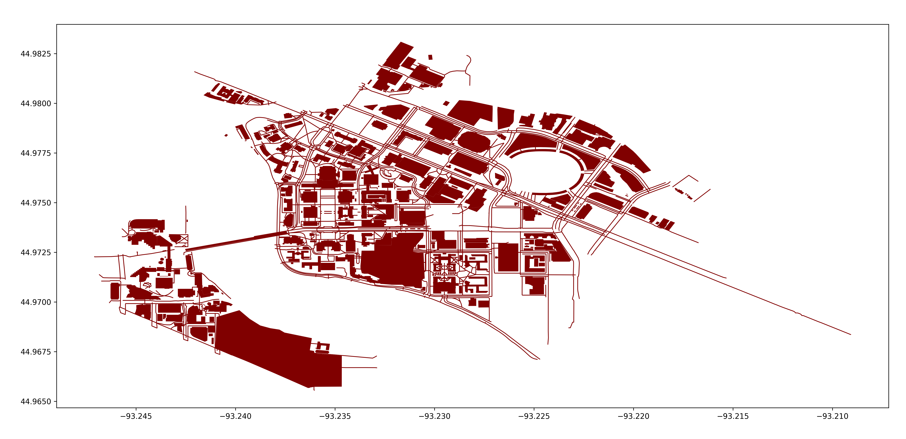

# Shortest-Path Finding within the University of Minnesota Minneapolis campus map

### Introduction

This project aims to explore the shortest path using five different algorithms
including A* w Manhattan [ASM], A* w Haversine [ASH], Bidirectional Search [BDS],
Breadth-First Search [BFS], and Dijkstra's Algorithm [DKS].

### Tools Used

- App/Web: Node.js, Express, HTML+CSS+JS
- Data: OpenStreetMap, Overpass Turbo
- Graph: Python, GeoPandas, MatplotLib

### Installation & Configuration & Run the App!

- To set up the environment, make sure you have already installed [Node.js](https://nodejs.org/en) on your machine.
- To clone the repo, open the Terminal at your folder and enter the command:
  ``` 
  git clone https://github.umn.edu/WANG9747/umn-csci4511w-final-project.git 
  ```
- After copying the repo, install required packages by the command:
  ``` 
  npm install
  ```
- You are free to run the app at this point by the command (modify pathname if needed):
  ```
  node app/app.js
  ```
- Open the Browser (Google Chrome if possible) and enter the address:
  ```
  http://localhost:8888/
  ```

### Graph under the map



### Some bugs?

- Our GeoJSON dataset is not large enough to cover all places on the UMN campus,
  make sure that selected places are inside the campus.
- Our GeoJSON dataset is not accurate enough to allow you to click any point on the map,
  but most of "normal" places inside the campus are covered.
- If you want to run the Test Mode, make sure you follow the instruction about the browser on the Experiment page.
- There might be some cases that the position of your markers are slightly "adjusted" for our dataset.  
